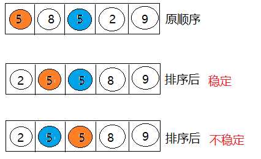

---

---

Dos命令

```java
class HelloWorld//类型名
{

	public static void main(String[] args){
		System.out.println("helloworld");
	}

}
```

先用javac 文件名——编译（Javac——编译命令）

Java 类型名——运行

> 修改后要再次编译


# java基础语法

## Java技术体系平台

- **Java SE(Java Standard Edition)标准版**
  - 支持面向`桌面级应用`（如Windows下的应用程序）的Java平台，即定位个人计算机的应用开发。
  - 包括用户界面接口AWT及Swing，网络功能与国际化、图像处理能力以及输入输出支持等。
  - 此版本以前称为J2SE
- **Java EE(Java Enterprise Edition)企业版**
  - 为开发企业环境下的应用程序提供的一套解决方案，即定位`在服务器端的Web应用开发`。
  - JavaEE是JavaSE的扩展，增加了用于服务器开发的类库。如：Servlet能够延伸服务器的功能，通过请求-响应的模式来处理客户端的请求；JSP是一种可以将Java程序代码内嵌在网页内的技术。
  - 版本以前称为J2EE
- **Java ME(Java Micro Edition)小型版**
  - 支持Java程序运行在`移动终端（手机、机顶盒）上的平台`，即定位在消费性电子产品的应用开发
  - JavaME是JavaSE的内伸，精简了JavaSE 的核心类库，同时也提供自己的扩展类。增加了适合微小装置的类库：javax.microedition.io.*等。
  - 此版本以前称为J2ME


> 注意：
>
> Android开发不等同于Java ME的开发

##  Java核心机制：JVM

### 1.1 Java语言的优缺点

Java确实是从C语言和C++语言继承了许多成份，甚至可以将Java看成是类C语言发展和衍生的产物。“青出于蓝，而胜于蓝”。

#### 1.1.1 优点

* **跨平台性：**这是Java的核心优势。Java在最初设计时就很注重移植和跨平台性。比如：Java的int永远都是32位。不像C++可能是16，32，可能是根据编译器厂商规定的变化。
* 通过Java语言编写的应用程序在不同的系统平台上都可以运行。“`Write once , Run Anywhere`”。
* 原理：只要在需要运行 java 应用程序的操作系统上，先安装一个Java虚拟机 (`J`VM ，Java `V`irtual `M`achine) 即可。由JVM来负责Java程序在该系统中的运行。


* **面向对象性：**

  面向对象是一种程序设计技术，非常`适合大型软件的设计和开发`。面向对象编程支持封装、继承、多态等特性，让程序更好达到`高内聚`，`低耦合`的标准。

* **健壮性：**吸收了C/C++语言的优点，但去掉了其影响程序健壮性的部分（如指针、内存的申请与释放等），提供了一个相对安全的内存管理和访问机制。

* **安全性高：**

  Java适合于网络/分布式环境，需要提供一个安全机制以防恶意代码的攻击。如：`安全防范机制`（ClassLoader类加载器），可以分配不同的命名空间以防替代本地的同名类、字节代码检查。

* **简单性：**

  Java就是C++语法的`简化版`，我们也可以将Java称之为“`C++--`”。比如：头文件，指针运算，结构，联合，操作符重载，虚基类等。

* **高性能：**

  - Java最初发展阶段，总是被人诟病“`性能低`”；客观上，高级语言运行效率总是低于低级语言的，这个无法避免。Java语言本身发展中通过虚拟机的优化提升了`几十倍运行效率`。比如，通过JIT(JUST IN TIME)即时编译技术提高运行效率。

  - `Java低性能的短腿，已经被完全解决了`。业界发展上，我们也看到很多C++应用转到Java开发，很多C++程序员转型为Java程序员。

#### 1.1.2 缺点

- `语法过于复杂、严谨`，对程序员的约束比较多，与python、php等相比入门较难。但是一旦学会了，就业岗位需求量大，而且`薪资待遇节节攀升`。
- 一般适用于大型网站开发，`整个架构会比较重`，对于初创公司开发和维护人员的成本比较高（即薪资高），选择用Java语言开发网站或应用系统的需要一定的经济实力。
- `并非适用于所有领域`。比如，Objective C、Swift在iOS设备上就有着无可取代的地位。浏览器中的处理几乎完全由JavaScript掌控。Windows程序通常都用C++或C#编写。Java在服务器端编程和跨平台客户端应用领域则很有优势。

### 1.2 JVM功能说明

**JVM**（`J`ava `V`irtual `M`achine ，Java虚拟机）：是一个虚拟的计算机，是Java程序的运行环境。JVM具有指令集并使用不同的存储区域，负责执行指令，管理数据、内存、寄存器。


#### 1.2.1 功能1：实现Java程序的跨平台性

我们编写的Java代码，都运行在**JVM** 之上。正是因为有了JVM，才使得Java程序具备了跨平台性。


使用JVM前后对比：


#### 1.2.2 功能2：自动内存管理(内存分配、内存回收)

- Java程序在运行过程中，涉及到运算的`数据的分配`、`存储`等都由JVM来完成
- Java消除了程序员回收无用内存空间的职责。提供了一种系统级线程跟踪存储空间的分配情况，在内存空间达到相应阈值时，检查并释放可被释放的存储器空间。
- GC的自动回收，提高了内存空间的利用效率，也提高了编程人员的效率，很大程度上`减少了`因为没有释放空间而导致的`内存泄漏`。

> 面试题：
>
> Java程序还会出现内存溢出和内存泄漏问题吗？  Yes!

## 一、变量与运算符

### 1.关键字与保留字


>说明：
>
>1. 关键字一共`50个`，其中`const`和`goto`是`保留字`(reserved word)。
>2. `true`，`false`，`null`不在其中，它们看起来像关键字，其实是字面量，表示特殊的布尔值和空值。


### 2.标识符

#### 2.1定义合法标识符规则：//严格遵守

- 由26个英文字母大小写，0-9，_或$组成


- 数字不可以开头

- 不可以使用关键字和保留字，但能包含关键字和保留字

- Java中严格区分大小写，长度无限制

- 标识符不能包含空格


#### 2.2Java中的名称命名规范：//建议

- 包名：多单词组成时所有字母都小写：xxxyyyzzz

- 类名、接口名：多单词组成时，所有单词的首字母大写：XxxYyyZzz

- 常量名、方法名：第一个单词首字母小写，第二个单词开始每个单词首字母大写：xxxYyyZzz

- 常量名：所有字母都大写。多单词时每个单词用下划线连接：XXX YYY ZZZ


### 3.变量

#### 3.1使用变量注意：

- Java中每个交量必须先声明，后使用


- 使用变量名来访间这块区域的数据


- 变量的作用域：其定义所在的一对{}内


- 变量只有在其作用域内才有效


- 同一个作用域内，不能定义重名的变量


#### 3.2变量按照数据类型来分：

1. ##### 基本数据类型：


- 整型：byte（1字节）-128~127

  > 整型常量默认为int

  >```java
  >byte b1 = 12;
  >byte b2 = b1 + 1;//自动类型提升
  >b1 = b1 + 1;//编译会出错
  >+1导致右边被认为为int,byte不能被赋予int
  >```

  

​                  short（2字节）-2^15^~2^15^-1

​                  int（4字节）-2^31^~2^31^-1

​                  long（8字节）-2^63^~2^63^-1

> long型变量必须以“l”或“L”结尾——long l1 = 31245L;
>
> ```java
> long l1 = 12456;
> System.out.println(l1);
> //没报错原因是:自动看作int型
> long l2 = 9845445584225245;
> System.out.println(l2);
> //报错原因是:超出了int所能表达的范围
> ```
>


-  浮点型：float（4字节）7位有效数字——单精度

-  

   > 浮点型默认为double
   >
   > 浮点型常量有两种表示形式：
   >
   > - 十进制数形式。如：5.12       512.0f        .512   (必须有小数点）
   > - 科学计数法形式。如：5.12e2      512E2     100E-2
   >
   > float类型变量必须要带”f”或”F“——float f1 = 12.3F;
   >
   > 并不是所有的小数都能可以精确的用二进制浮点数表示。二进制浮点数不能精确的表示0.1、0.01、0.001这样10的负次幂。
   >
   > 浮点类型float、double的数据不适合在`不容许舍入误差`的金融计算领域。如果需要`精确`数字计算或保留指定位数的精度，需要使用`BigDecimal类`。


> ```java
>float f1 = 12.3;
> //自动看作double型,不能用小范围的float储存更大的double,编译错误
> ```
> 

​                       double（8字节）双精度

```java
double price;
double amount;
price=(int)(30/3.0);//强转
System.out.println(price);
System.out.println(1.2-1.1);//二进制不能准确表示一些小数，比如1/10
System.out.print("请输入英尺:");
amount = in.nextDouble();
System.out.print("请输入英寸:");
price = in.nextDouble();
System.out.println("身高="+((int)((amount+price/12)*30.48))+"cm");
```


- 字符型：char(2字节)//Unicode中的字符

- 字符型变量的三种表现形式：

  - **形式1：**使用单引号(' ')括起来的`单个字符`。

    例如：char c1 = 'a';   char c2 = '中'; char c3 =  '9';

  - **形式2：**直接使用 `Unicode值`来表示字符型常量：‘`\uXXXX`’。其中，XXXX代表一个十六进制整数。

    例如：\u0023 表示 '#'。

  - **形式3：**Java中还允许使用`转义字符‘\’`来将其后的字符转变为特殊字符型常量。

    例如：char c3 = '\n';  // '\n'表示换行符

    | 转义字符 |  说明  | Unicode表示方式 |
    | :------: | :----: | :-------------: |
    |   `\n`   | 换行符 |     \u000a      |
    |   `\t`   | 制表符 |     \u0009      |
    |   `\"`   | 双引号 |     \u0022      |
    |   `\'`   | 单引号 |     \u0027      |
    |   `\\`   | 反斜线 |     \u005c      |
    |   `\b`   | 退格符 |     \u0008      |
    |   `\r`   | 回车符 |     \u000d      |

- char变量加减是各自在Unicode中的编号做运算

  ```java
  System.out.println('a' + 1 +"hello");//98hello
  ```

  ```java
  //char单字符类型
  char c = 'A';//''中为单个字符：汉字、字母等
  System.out.println(c);
  System.out.println((int)c);//把c整数化即输出c在Unicode中的编号
  char a = 65;
  System.out.println(a);
  char b = '\u0041';// 0041是16进制，\u表示这是Unicode中的编号
  System.out.println(b);
  //字符计算
  c++;//输出Unicode中下一个编号的字符
  System.out.println(c);
  char d = 'B';
  System.out.println(d-c);
  //大小写转换
  char e = (char)(c + 'a'-'A');//字符运算后会整数化，用char变回字符
  System.out.println(e);
  //字符大小 即比较编码大小
  char f = '汉';
  System.out.println(c>f);
  ```


```java
System.out.println("你就不能参加\"单身\"party了！\\n很遗憾");
```

- 布尔型：boolean

  > 不能转换为其他类型
  >
  > **boolean类型数据只有两个值：true、false，无其它。**
  >
  > - 不可以使用0或非 0 的整数替代false和true，这点和C语言不同。
  > - 拓展：Java虚拟机中没有任何供boolean值专用的字节码指令，Java语言表达所操作的boolean值，在编译之后都使用java虚拟机中的int数据类型来代替：true用1表示，false用0表示。——《java虚拟机规范 8版》

##### 2.引用数据类型：

- 类(class)
- 接口(interface)
- 数组(array)


#### 3.3基本数据类型运算规则

1. ##### 自动类型提升

   byte,char,short<int<long<float<double (容量—表示数的范围)

   容量小的数据类型与大的做运算,结果自动提升为大的数据类型

   做运算时如果范围在int内,结果都用int

   

   ```java
   byte b1 = 2;
   int i1 = 12;
   byte b2 = b1 + i1;
   float f2 = bi + i1;
   System.out.println(b2);
   //编译不通过,byte只有一字节,不能接受int四字节的数据,会丢失
   System.out.println(f2);
   //会自动补零-输出14.0
   ```

   （1）当把存储范围小的值（常量值、变量的值、表达式计算的结果值）赋值给了存储范围大的变量时

   ```java
   int i = 'A';//char自动升级为int，其实就是把字符的编码值赋值给i变量了
   double d = 10;//int自动升级为double
   long num = 1234567; //右边的整数常量值如果在int范围呢，编译和运行都可以通过，这里涉及到数据类型转换
   
   //byte bigB = 130;//错误，右边的整数常量值超过byte范围
   long bigNum = 12345678912L;//右边的整数常量值如果超过int范围，必须加L，显式表示long类型。否则编译不通过
   ```

   （2）当存储范围小的数据类型与存储范围大的数据类型变量一起混合运算时，会按照其中最大的类型运算。

   ```java
   int i = 1;
   byte b = 1;
   double d = 1.0;
   
   double sum = i + b + d;//混合运算，升级为double
   ```

   （3）当byte,short,char数据类型的变量进行算术运算时，按照int类型处理。

   ```java
   byte b1 = 1;
   byte b2 = 2;
   byte b3 = b1 + b2;//编译报错，b1 + b2自动升级为int
   
   char c1 = '0';
   char c2 = 'A';
   int i = c1 + c2;//至少需要使用int类型来接收
   System.out.println(c1 + c2);//113 
   ```

2. ##### 强制类型转换

   强制符()

   > 可能会导致精度损失

   **规则：将取值范围大（或容量大）的类型强制转换成取值范围小（或容量小）的类型。**
   
   > 自动类型提升是Java自动执行的，而强制类型转换是自动类型提升的逆运算，需要我们自己手动执行。
   
   **转换格式：**
   
   ```java
   数据类型1 变量名 = (数据类型1)被强转数据值;  //()中的数据类型必须<=变量值的数据类型
   ```
   
   ```java
   double d1 = 12.3;
   int i1 = (int)d1;
   System.out.println(i1);
   ```
   
   ```java
   //温度转换
   int F = in.nextInt();
   double C = 0;
   C = (F - 32)/(9/5);
   System.out.println((int)C);//整数化
   ```
   
   （1）当把存储范围大的值（常量值、变量的值、表达式计算的结果值）强制转换为存储范围小的变量时，可能会`损失精度`或`溢出`。
   
   ```java
   int i = (int)3.14;//损失精度
   
   double d = 1.2;
   int num = (int)d;//损失精度
   
   int i = 200;
   byte b = (byte)i;//溢出
   ```
   
   （2）当某个值想要提升数据类型时，也可以使用强制类型转换。这种情况的强制类型转换是`没有风险`的，通常省略。
   
   ```java
   int i = 1;
   int j = 2;
   double bigger = (double)(i/j);
   ```
   
   （3）声明long类型变量时，可以出现省略后缀的情况。float则不同。
   
   ```java
   long l1 = 123L;
   long l2 = 123;//如何理解呢？ 此时可以看做是int类型的123自动类型提升为long类型
   
   //long l3 = 123123123123; //报错，因为123123123123超出了int的范围。
   long l4 = 123123123123L;
   
   
   //float f1 = 12.3; //报错，因为12.3看做是double，不能自动转换为float类型
   float f2 = 12.3F;
   float f3 = (float)12.3;
   ```
   


#### 3.4字符串类型String

- String属于引用数据变量(中文翻译字符串)

- String可以和8种基本数据类型变量做运算(只能是连接运算: + )

  结果也是String

- 任意八种基本数据类型的数据与String类型只能进行连接“+”运算，且结果一定也是String类型
- String类型不能通过强制类型()转换，转为其他的类型

```java
//String多字符类型 字符串不能修改，改动建立在新的字符串上
//String的变量是一个管理者
String s = new String("hello");
System.out.println(s);
String a = "hello";
System.out.println(a);
System.out.println(s+12+24);//其它符号会变成字符连接

//输入字符串
String b = in.next();//只读一个字符串，遇空格停止
System.out.println(b);
String c = in.nextLine();//读入一行
System.out.println(c);

//比较字符串是否相同（后面详细讲==与equals的区别）
String d = in.next();
System.out.println( d == "hello");
System.out.println( d.equals("hello"));

//比较String大小 （根据在Unicode中的编号比较）
String s1 = "abc";
String s2 = "abd";
System.out.println(s1.length());//.length()表示字符数量
System.out.println(s1.compareTo(s2));//s1=s2返回0；s1<s2返回-1；s1>s2返回1
if ( s1.compareTo(s2) == -1){
	System.out.println(s2+">"+s1);
}else{
	System.out.println(s1+">"+s2);
}

//访问String中的字符
String s1 = "abc";
System.out.println(s1.charAt(2));//读取2号位的字符（0开始计数）
for ( int i=0; i<s1.length(); i++ )//不能用for-each
{
	System.out.println(s1.charAt(i));
}

// 得到其中一段字符串
String s1 = "年龄决定了你的精神世界，好好珍惜吧";
System.out.println(s1.substring(2));//2号位到结尾
System.out.println(s1.substring(2,5));//2号位到5号位前

//寻找字符
String s1 = "abcdefghijkdbcay";
System.out.println(s1.indexOf('d'));//只会输出第一个找到的
System.out.println(s1.indexOf('4'));//没找到返回-1
System.out.println(s1.indexOf("ghi"));

int loc = s1.indexOf('d');
System.out.println(s1.indexOf('3',loc+1));//找第二个d

//split()拆分字符串（正则表达式）
```

**可变字符串：**StringBuilder类和StringBuffer


##### 练习1

``` java
char c = 'a';//97
int num = 10;
String str = "hello";
System.out.println(c+ num + str);//107hello
System.out.println(c+ str + num);//ahello10
System.out.println(str+ num + c);//hello10a
System.out.println((c+ num) + str);//107helo
System.out.println(c+ (num + str);//a10hello
```

##### 练习2

```java
System.out.println("* *");//* *
System.out.println('*' + '\t' + '*');//93
System.out.println('*' + "\t" + '*');//*	*
System.out.println('*' + '\t' + "*");//51*
System.out.println('*' + ('\t' + "*"));//*	*
```

##### 练习3

```java
String str1 = 3.5f + "";
System.out.println(str1);//3.5f
```


#### 3.5进制

- 二进制：0，1 ，满2进1，以0b或0B开头
- 十进制：0-9，满10进1
- 八进制：0-7，满8进1，以数字0开头
- 十六进制：0-9及A-F，满16进1，以0x或0X开头（A-F不区分大小写）

> 最前面的bit是符号位，0为正数，-1为负数


### 4.运算符

#### 4.1算术运算符


> 自增1不会改变本身的数据类型
>
> ```java
> short s = 2;
> s = s + 2;//2默认为int，s不能转化为范围更大的int
> s += 2;//自增不变
> ```

```java
//前++，先自增；后++，先运算再自增
int a = 1, b = 1;
int c = a++;
int d = ++b;
System.out.println(a+" "+b+" "+c+" "+d+" ");
```


#### 4.2赋值运算符

- 符号： =
- 扩展：+=  -=  *=  /=  %=

> 不改变数据类型

```java
int i = 1；
i *= 0.1;
System.out.println(i);//0
```

```java
int n = 10;
n += (n++) + (++n);
System.out.println(n);//32
```

#### 4.3比较运算符


#### 4.4逻辑运算符


```java
boolean b1 = false;
int num1 = 10;
if (b1 & (num1++ > 0)){
	System.out.primtln("北京");
}else{
	System.out.primtln("南京")；
}
System.out.primtln(num1)；//南京 11
//逻辑与&两边的条件都会运算判断
```

```java
boolean b2 = false;
int num2 = 10;
if (b2 && (num2++ > 0)){
	System.out.primtln("北京");
}else{
	System.out.primtln("南京")；
}
System.out.primtln(num2)；//南京 10
//短路与&&当判断了左边的条件就足以得出结论时，右边的条件就不再运算判断
```

> 同理，|和||也是一样

##### 练习

```java
boolean x = true;
boolean y = false;
short z = 42;
if ( y == true )
if ((z++ == 42) && (y = true))z++;
if ((x = false) || (++z == 45))z++;
System.out.println(z);//43
```

#### 4.5位运算符


#### 4.6三元运算符


```java
int n1 = 12;
int n2 = 30;
int n3 = -43;
int max1 = (n1 > n2)? n1 : n2;
int max2 = (max1 > n3)? max1 : n3;
System.out.println("三个数中的最大值是：" + max2)；
```


### 运算符的优先级


```java
//报酬计算
final double RATE = 8.25;
final int STANDARD = 40;
double pay = 0.0;
Scanner in = new Scanner(System.in);
System.out.print("Enter the number of hours worked:");
int hours = in.nextInt();
System.out.println();
if (hours>STANDARD)
pay = STANDARD * RATE +(hours-STANDARD) * (RATE*1.5);
else
pay = hours * RATE;
System.out.println("Gross earnings:"+pay);
```


## 二、流程控制

### 1.顺序结构

### 2.分支结构

#### 2.1 if——else结构

- 第一种：

  if （条件表达式）{

  执行表达式

  }

- 第二种：

  if （条件表达式）{

  执行表达式

  }else{

  执行表达式}

- 第三种：

  if （条件表达式1）{
  执行表达式1

  }else if（条件表达式2）{

  执行表达式2

  ……

  }else{
  执行表达式n};
  
  ```java
  int x = in.nextInt();
  int y = in.nextInt();
  int z = in.nextInt();
  if( x>y && x>z ) {
  			if ( y>z )
  				System.out.println("x>y>z");
  			else
  				System.out.println("x>z>y");
  		}else if ( y>x && y>z ){
  			if ( x>z )
  				System.out.println("y>x>z");
  			else
  				System.out.println("y>z>x");	
  		}else if ( z>x && z>y ) {
  			if ( x>y )
  				System.out.println("z>x>y");
  			else
  				System.out.println("z>y>x");
  	}
  ```
  
  ```java
  int x = 4,y = 1;
  if ( x>2 )
  	if ( y>2 )
  		System.out.println( x+y );
  		//System.out.println("atgugiu");
  	else//就近原则
          System.out.println("x is " + x);
  ```
  
  ##### 练习：week7

#### 2.2 switch - case


表达式只能是：byte 、short、char、int、枚举类型、String类型

default相当于if-else里的else

```java
int score = in.nextInt();
switch ( score / 10 ){
case 0 :
case 1 :
case 2 :
case 3 :
case 4 :
case 5 :
	System.out.println("不及格");
	break;
case 6 :
case 7 :
case 8 :
case 9 :
case 10 :
	System.out.println("及格");
	break;
}//相邻多个case执行语句相同是可合并
switch ( score / 60 ){//更优解
case 0 ：
	System.out.println("不及格");
	break;
case 1 ：
	System.out.println("及格");
	break;
    
```


### 3.循环结构

> 在循环内定义初始化的变量，循环外无法使用

#### 3.1 for循环

```java
//输出100内的质数
for ( int i=2; i<=100; i++ )
{
    boolean isFlag = true;
	for ( int k=2; k<=Math.sqrt(i); k++ )//平方根更优
    {
        if ( i%k == 0 )
        {
            isFlag = false;
            break;
        }
	}
    if ( isFlag == true )
    {
        System.out.println(i);
    }    
}
```

```java
//多重循环 字符+：称为标号 用于终止特定的循环
Scanner in = new Scanner(System.in);
int amount = in.nextInt();
PUT:
for(int a = 0; a<=amount; a++){
    for(int b = 0; b<=amount/5 ;b++){
        for(int c = 0; c<=amount/10 ;c++){
            if(a + b * 5 + c * 10 == amount){
                System.out.println( a + "张一块" + b + "张五块" + c + "张十块" );
                break PUT;
            }
        }
    }
}
```


```java
增强for循环:将数组/集合中的每个元素执行一遍循环体
for(数组类型 数组元素名 ：数组名){
	循环体
}
int[] b = new int[3];
for(int i : b) {
	i++;
}
```


#### 3.2 while循环

```java
int balance = 0;//读入投币金额
while(true){
    System.out.print("请投币:");
    int amount;
    amount = in.nextInt();
    System.out.println(amount);
    System.out.println(amount>=10);
    balance = balance + amount;
    if(balance>=10){
    //打印车票
        System.out.println("***************");
        System.out.println("*Java城际铁路专线*");
        System.out.println("*无指定坐票位*");
        System.out.println("*票价：10元");
        System.out.println("***************");
        //		计算并找零
        System.out.println("找零："+(balance-10)+"元");
        balance = 0;
    }else
		System.out.println("您的余额不足,请继续投币");
}
```


#### 3.3 do - while循环

do-while循环至少会循环一次

```java
int number = (int)(Math.random()*100+1);// [0,1) -->[0,100) --> [1,100]随机数字
int count = 0;
int a ;
do {
    a = in.nextInt();
    count = count + 1;
    if( a > number )
    {
        System.out.println("偏大");
    } 
    else if ( a< number )
    {
        System.out.println("偏小");
    }
}while ( a!=number );
System.out.println("恭喜你猜对了"+"你猜了"+count+"次");
```


#### 3.4 关键字break与continue

- break：结束循环

> break+type 结束指定循环，否则就近原则

- continue：结束本次循环（swich-case不能用）

>continue+type 结束指定循环

```java
//输出100内的质数
labe1:for ( int i=2; i<=100; i++ )
{
	for ( int k=2; k<=Math.sqrt(i); k++ )//平方根更优
    {
        if ( i%k == 0 )
        {
        	continue labe1;
        }
	}
	System.out.println(i);
}
```


## 三、数组

### 1.一维数组

#### 1.1声明和初始化

数组一旦初始化，其长度就固定

```java
int[] ids;//声明
ide = new int[]{1001,1002};//静态初始化：初始化与赋值同时进行
String[] names = new String[5];//动态初始化：初始化与赋值分开进行
String names[] = new String[5];//也可以但不推荐
```

#### 1.2调用指定位置元素

```java
System.out.println(names[0]);
```

#### 1.3获取数组长度

```java
System.out.println(names.length);
```

#### 1.4遍历数组

```java
for ( int i=0; i<names.length; i++ )
{
	System.out.println(names[i]);
}
```

```java
//for-each循环;适用于遍历等应用
boolean found = false;
for ( int k : numbers )//k为数组的元素且每次循环不断变化
{
	if ( k == x )//k与元素是数值相等，不能通过赋值k的方式改变数组
    {
        found = true;
        System.out.println(found);
        break;
    }
}
if ( loc != -1 ){
	System.out.println(x+"是第"+(loc+1)+"个");
}else{
System.out.println(x+"不再其中");
}
```


#### 1.5数组元素默认初始化值

整型：0

浮点型：0.0

char型：0 //指编号

boolean型：false

引用数据类型：null

#### 1.6内存解析

**Java虚拟机的内存划分** 

为了提高运算效率，就对空间进行了不同区域的划分，因为每一片区域都有特定的处理数据方式和内存管理方式。


| 区域名称   | 作用                                                         |
| ---------- | ------------------------------------------------------------ |
| `虚拟机栈` | 用于存储正在执行的每个Java方法的局部变量表等。局部变量表存放了编译期可知长度 的各种基本数据类型、对象引用，方法执行完，自动释放。 |
| `堆内存`   | 存储对象（包括数组对象），new来创建的，都存储在堆内存。      |
| `方法区`   | 存储已被虚拟机加载的类信息、常量、（静态变量）、即时编译器编译后的代码等数据。 |
| 本地方法栈 | 当程序中调用了native的本地方法时，本地方法执行期间的内存区域 |
| 程序计数器 | 程序计数器是CPU中的寄存器，它包含每一个线程下一条要执行的指令的地址 |


```java
//直接初始化数组
int[] scores = {28, 46, 5, 9, 2, 478, 35, 62, 21};
System.out.println("数组中有"+scores.length+"个元素");
for ( int i=0; i<scores.length; i++ ){//遍历数组
	System.out.println(scores[i]+" ");
}
//数组变量赋值
int[] a1 = {1,2,3,4,5};
int[] a2 = a1;
//a1,a2只是数组的管理者，本身不能赋值，a1=a2指a1，a2管理同一个数组
for ( int i=0; i<a2.length; ++i ){
	a2[i] ++;
}
for ( int i=0; i<a1.length; ++i ){
	System.out.println(a1[i]);
}
//数组比较
//只有管理同一个数组才相等
int[] a = {1,2,3,4,5};
int[] b = a;
int[] c = {1,2,3,4,5};
System.out.println(a==b);
System.out.println(a==c);
```

#### 练习：work1


### 2.二维数组

#### 2.1声明和初始化

```java
//初始化方式一
int[][] arr = new int[4][3];
//外层元素初始化为一维数组地址值，内层与一维数组初始化情况相同
//初始化方式二
int[][] arr = new int[4][];
//外层元素初始化为null，内层初始化值不能调用，否则报错

int[][] arr1 = new int[][]{{1,2,3},{4,5},{6,7,8,}};
String[][] arr2 = new String[3][2];
int[] arr3[] = new int[][]{{1,2,3},{4,5},{6,7,8}};
int[] arr4[] = {{1,2,3},{4,5},{6,7,8}};
arr[1] = new String[4];//第一行赋予四个元素
```

#### 2.2调用指定元素

```java
System.out.println(names[0][1]);//第一行第一个元素
```

#### 2.3获取数组长度

```java
System.out.println(arr1.length);//3
System.out.println(arr1[0].length);//3
System.out.println(arr1[1].length);//2
```

#### 2.4遍历二维数组

```java
for ( int i=0; i<arr.length; i++ )
{
	for ( int j=0; j>arr[i].length; j++ )
	{
		System.out.println(arr[i][j]+" ");
	}
}
```

>```java
>int[][] arr = new int[4][3];
>System.out.println(arr[0]);
>//输出为它所管理的一维数组地址值
>System.out.println(arr[0][0]);
>//输出0
>System.out.println(arr);
>//二维数组的地址值
>```

```java
int[]x,y[]//x为一维int数组，y为二维int数组
x[0] = y;//false int数不能赋予二维数组
y[0] = x;//true 一维元素可以赋予一维数组
y[0][0] = x;//false int数不能赋予一维数组
x[0][0] = y//false x为一维数组不能写成x[][]
y[0][0] = x[0];//yes int数可以赋予int数
x = y;//false 一维不能赋予二维
```

#### 2.5内存解析

二维数组本质上是元素类型是一维数组的一维数组。

```java
int[][] arr = {
    {1},
    {2,2},
    {3,3,3},
    {4,4,4,4},
    {5,5,5,5,5}
};
```


```java
//1、声明二维数组，并确定行数和列数
int[][] arr = new int[4][5];

//2、确定元素的值
for (int i = 0; i < arr.length; i++) {
    for (int j = 0; j < arr.length; j++) {
        arr[i][j] = i + 1;
    }
}
```


```java
//1、声明一个二维数组，并且确定行数
//因为每一行的列数不同，这里无法直接确定列数
int[][]  arr = new int[5][];

//2、确定每一行的列数
for(int i=0; i<arr.length; i++){
    /*
			arr[0] 的列数是1
			arr[1] 的列数是2
			arr[2] 的列数是3
			arr[3] 的列数是4
			arr[4] 的列数是5
			*/
    arr[i] = new int[i+1];
}

//3、确定元素的值
for(int i=0; i<arr.length; i++){
    for(int j=0; j<arr[i].length; j++){
        arr[i][j] = i+1;
    }
}
```


#### 练习：work2


### 3.多维数组使用

#### 3.1数组元素的赋值（杨辉三角、回型数等）

#### 练习：work3

#### 3.2数值型求最大值、最小值、平均数、总和等

```java
int[] arr = new int[10];
		for ( int i=0; i<arr.length; i++ )
		{
		    arr[i] = (int)(Math.random()*100);
		}
		int maxValue = arr[0];
		int minValue = arr[0];
		int sum = 0;
		for ( int i=1; i<arr.length; i++ )
		{
			if (maxValue<arr[i])
			{
				maxValue = arr[i];
			}
		    if (minValue<arr[i])
			{
				minValue = arr[i];
			}
		    sum += arr[i];
		}
		System.out.println("最大值是"+maxValue);
		System.out.println("最小值是"+minValue);
		System.out.println("总和是"+sum);
		System.out.println("平均数"+sum/10);
```


#### 3.3数组的复制、反转、查找（二分法）

```java
int[] a = {1,2,3,4,5};
int[] b = new int[a.length];
for ( int i=0; i<b.length; ++i ){
	b[i] = a[i];
}
boolean isEqu = true;//判断是否复制成功
for ( int i=0; i<b.length; ++i ){
    if ( a[i] != b[i] ){
        isEqu = false;
        break;
    }
}
System.out.println(isEqu);
System.out.println(e==f);

//arraycopy复制
//arraycopy(原数组，原数组起始下标，目的数组，目的数组起始下标，复制个数)
int[] a = {1,2,3,4,5};
int[] b = new int[a.length];
System.arraycopy(a, 0, b, 0, 3);
for(int i : b) {
    System.out.println(i);
}
```

```java
//在数组内查找一个数
int[] numbers = {3,6,89,45,14,2,78,94,5};
int x = in.nextInt();
int loc = -1;
for ( int i=0; i<numbers.length; i++ ){
	if ( x == numbers[i] ){
		loc = i;
		break;
	}
}
```

```java
//数组反转 方法一
String[] arr = new String[]{"a","b","c"};
for ( int i=0; i<arr.length; i++ ){
	String temp = arr[i];
	arr[i] = arr[arr.length - i - 1];
	arr[arr.length - i - 1] = temp;
}
//方法二
for ( int i=0,j=arr.length-1; i<j; i++,j-- ){
    String temp = arr[i];
    arr[i] = arr[j];
    arr[j] = temp;
}
```

```java
//线性查找
String[] arr = new String[]{"a","b","c","d","e"};
String dest = "b"
boolean isFlag = true;
for ( int i=0; i<arr.length; i++ ){
	if ( dest.equals(arr[i])){
     	System.out.println("位置："+i);
        isFlag = false;
        break;
    }
}
if (isFlag){
    System.out.println("没有");
}
//二分法查找(前提是数组有序)
int[] arr2 = new int[]{-95,-16,-9,1,4,8,26,35};
int dest2 = 8;
int head = 0;//初始首索引
int end = arr2.length-1;//初始末索引
boolean isFlag1 = true;
while ( head<=end ){
	int middle = (head + end)/2;
    if ( dest2 == arr2[middle]){
        System.out.println("位置为："+middle);
        isFlag1 = false;
        break;
    }else if ( arr2[middle]>dest2 ){
        end = middle - 1;
    }else{
        head = middle + 1;
    }
}
if (isFlag1){
    System.out.println("没有");
}
```


#### 3.4数组元素的排序

##### 3.4.1 算法概述

- **定义**

  - 排序：假设含有n个记录的序列为{R1，R2，...,Rn},其相应的关键字序列为{K1，K2，...,Kn}。将这些记录重新排序为{Ri1,Ri2,...,Rin},使得相应的关键字值满足条Ki1<=Ki2<=...<=Kin,这样的一种操作称为排序。
  - 通常来说，排序的目的是快速查找。

- **衡量排序算法的优劣：**

  - `时间复杂度`：分析关键字的比较次数和记录的移动次数

  - 常见的算法时间复杂度由小到大依次为：Ο(1)＜Ο(log2n)＜Ο(n)＜Ο(nlog2n)＜Ο(n<sup>2</sup>)＜Ο(n<sup>3</sup>)＜…＜Ο(2<sup>n</sup>)＜Ο(n!)<O(n<sup>n</sup>)

  - `空间复杂度`：分析排序算法中需要多少辅助内存

    ```
    一个算法的空间复杂度S(n)定义为该算法所耗费的存储空间，它也是问题规模n的函数。
    ```

  - `稳定性`：若两个记录A和B的关键字值相等，但排序后A、B的先后次序保持不变，则称这种排序算法是稳定的。

    

##### 3.4.2 排序算法概述

- **排序算法分类：内部排序和外部排序**
  - `内部排序`：整个排序过程不需要借助于外部存储器（如磁盘等），所有排序操作都在内存中完成。
  - `外部排序`：参与排序的数据非常多，数据量非常大，计算机无法把整个排序过程放在内存中完成，必须借助于外部存储器（如磁盘）。外部排序最常见的是多路归并排序。可以认为外部排序是由多次内部排序组成。

- **十大内部排序算法**

​       数组的排序算法很多，实现方式各不相同，时间复杂度、空间复杂度、稳定性也各不相同：


常见时间复杂度所消耗的时间从小到大排序：

**O(1) < O(logn) < O(n) < O(nlogn) < O(n^2) < O(n^3) < O(2^n) < O(n!) < O(n^n)**

注意，经常将以2为底n的对数简写成logn。


##### 3.4.3 冒泡排序（Bubble Sort）


**排序思想：**

1. 比较相邻的元素。如果第一个比第二个大（升序），就交换他们两个。

2. 对每一对相邻元素作同样的工作，从开始第一对到结尾的最后一对。这步做完后，最后的元素会是最大的数。

3. 针对所有的元素重复以上的步骤，除了最后一个。

4. 持续每次对越来越少的元素重复上面的步骤，直到没有任何一对数字需要比较为止。


**动态演示：**https://visualgo.net/zh/sorting

```java
/*
1、冒泡排序（最经典）
思想：每一次比较“相邻（位置相邻）”元素，如果它们不符合目标顺序（例如：从小到大），
     就交换它们，经过多轮比较，最终实现排序。
	 （例如：从小到大）	 每一轮可以把最大的沉底，或最小的冒顶。
	 
过程：arr{6,9,2,9,1}  目标：从小到大

第一轮：
	第1次，arr[0]与arr[1]，6>9不成立，满足目标要求，不交换
	第2次，arr[1]与arr[2]，9>2成立，不满足目标要求，交换arr[1]与arr[2] {6,2,9,9,1}
	第3次，arr[2]与arr[3]，9>9不成立，满足目标要求，不交换
	第4次，arr[3]与arr[4]，9>1成立，不满足目标要求，交换arr[3]与arr[4] {6,2,9,1,9}
	第一轮所有元素{6,9,2,9,1}已经都参与了比较，结束。
	第一轮的结果：第“一”最大值9沉底（本次是后面的9沉底），即到{6,2,9,1,9}元素的最右边

第二轮：
	第1次，arr[0]与arr[1]，6>2成立，不满足目标要求，交换arr[0]与arr[1] {2,6,9,1,9}
	第2次，arr[1]与arr[2]，6>9不成立，满足目标要求，不交换
	第3次：arr[2]与arr[3]，9>1成立，不满足目标要求，交换arr[2]与arr[3] {2,6,1,9,9}
	第二轮未排序的所有元素 {6,2,9,1}已经都参与了比较，结束。
	第二轮的结果：第“二”最大值9沉底（本次是前面的9沉底），即到{2,6,1,9}元素的最右边
第三轮：
	第1次，arr[0]与arr[1]，2>6不成立，满足目标要求，不交换
	第2次，arr[1]与arr[2]，6>1成立，不满足目标要求，交换arr[1]与arr[2] {2,1,6,9,9}
	第三轮未排序的所有元素{2,6,1}已经都参与了比较，结束。
	第三轮的结果：第三最大值6沉底，即到 {2,1,6}元素的最右边
第四轮：
	第1次，arr[0]与arr[1]，2>1成立，不满足目标要求，交换arr[0]与arr[1] {1,2,6,9,9}
	第四轮未排序的所有元素{2,1}已经都参与了比较，结束。
	第四轮的结果：第四最大值2沉底，即到{1,2}元素的最右边

*/
public class Test19BubbleSort{
    public static void main(String[] args){
        int[] arr = {6,9,2,9,1};

        //目标：从小到大
        //冒泡排序的轮数 = 元素的总个数 - 1
        //轮数是多轮，每一轮比较的次数是多次，需要用到双重循环，即循环嵌套
        //外循环控制 轮数，内循环控制每一轮的比较次数和过程
        for(int i=1; i<arr.length; i++){ //循环次数是arr.length-1次/轮
			/*
			假设arr.length=5
			i=1,第1轮，比较4次
				arr[0]与arr[1]
				arr[1]与arr[2]
				arr[2]与arr[3]
				arr[3]与arr[4]
				
				arr[j]与arr[j+1]，int j=0;j<4; j++
				
			i=2,第2轮，比较3次
				arr[0]与arr[1]
				arr[1]与arr[2]
				arr[2]与arr[3]
				
				arr[j]与arr[j+1]，int j=0;j<3; j++
				
			i=3,第3轮，比较2次
				arr[0]与arr[1]
				arr[1]与arr[2]
				
				arr[j]与arr[j+1]，int j=0;j<2; j++
			i=4,第4轮，比较1次
				arr[0]与arr[1]
			
				arr[j]与arr[j+1]，int j=0;j<1; j++
				
				int j=0; j<arr.length-i; j++
			*/
            for(int j=0; j<arr.length-i; j++){
                //希望的是arr[j] < arr[j+1]
                if(arr[j] > arr[j+1]){
                    //交换arr[j]与arr[j+1]
                    int temp = arr[j];
                    arr[j] = arr[j+1];
                    arr[j+1] = temp;
                }
            }
        }

        //完成排序，遍历结果
        for(int i=0; i<arr.length; i++){
            System.out.print(arr[i]+"  ");
        }
    }
}
```

**冒泡排序优化（选讲）**

```java
/*
思考：冒泡排序是否可以优化
*/
class Test19BubbleSort2{
	public static void main(String[] args) {
        int[] arr = {1, 3, 5, 7, 9};

        //从小到大排序
        for (int i = 0; i < arr.length - 1; i++) {
            boolean flag = true;//假设数组已经是有序的
            for (int j = 0; j < arr.length - 1 - i; j++) {
                //希望的是arr[j] < arr[j+1]
                if (arr[j] > arr[j + 1]) {
                    //交换arr[j]与arr[j+1]
                    int temp = arr[j];
                    arr[j] = arr[j + 1];
                    arr[j + 1] = temp;

                    flag = false;//如果元素发生了交换，那么说明数组还没有排好序
                }
            }
            if (flag) {
                break;
            }
        }

        //完成排序，遍历结果
        for (int i = 0; i < arr.length; i++) {
            System.out.print(arr[i] + "  ");
        }
    }
}
```

##### 3.4.4 快速排序

快速排序（Quick Sort）由`图灵奖`获得者`Tony Hoare`发明，被列为`20世纪十大算法之一`，是迄今为止所有内排序算法中速度最快的一种，快速排序的时间复杂度为O(nlog(n))。

快速排序通常明显比同为O(nlogn)的其他算法更快，因此常被采用，而且快排采用了分治法的思想，所以在很多笔试面试中能经常看到快排的影子。

排序思想：

1. 从数列中挑出一个元素，称为"基准"（pivot），

2. 重新排序数列，所有元素比基准值小的摆放在基准前面，所有元素比基准值大的摆在基准的后面（相同的数可以到任一边）。在这个分区结束之后，该基准就处于数列的中间位置。这个称为分区（partition）操作。

3. 递归地（recursive）把小于基准值元素的子数列和大于基准值元素的子数列排序。

4. 递归的最底部情形，是数列的大小是零或一，也就是永远都已经被排序好了。虽然一直递归下去，但是这个算法总会结束，因为在每次的迭代（iteration）中，它至少会把一个元素摆到它最后的位置去。

**动态演示：**https://visualgo.net/zh/sorting

图示1：


图示2：

第一轮操作：


第二轮操作：


##### 3.4.5 内部排序性能比较与选择

- 性能比较
  - **从平均时间而言**：快速排序最佳。但在最坏情况下时间性能不如堆排序和归并排序。
  - **从算法简单性看**：由于直接选择排序、直接插入排序和冒泡排序的算法比较简单，将其认为是简单算法。对于Shell排序、堆排序、快速排序和归并排序算法，其算法比较复杂，认为是复杂排序。
  - **从稳定性看**：直接插入排序、冒泡排序和归并排序时稳定的；而直接选择排序、快速排序、 Shell排序和堆排序是不稳定排序
  - **从待排序的记录数n的大小看**，n较小时，宜采用简单排序；而n较大时宜采用改进排序。

- 选择
  - 若n较小(如n≤50)，可采用直接插入或直接选择排序。
    当记录规模较小时，直接插入排序较好；否则因为直接选择移动的记录数少于直接插入，应选直接选择排序为宜。
  - 若文件初始状态基本有序(指正序)，则应选用直接插入、冒泡或随机的快速排序为宜；
  - 若n较大，则应采用时间复杂度为O(nlgn)的排序方法：快速排序、堆排序或归并排序。


##### 练习：quickSort


#### 3.5常见数组工具


```java
int[] names = new int[5];
Arrays.fill(names, 10);
for (int i=0; i<names.length; i++) {
	System.out.println(names[i]);
}
System.out.println(Arrays.binarySearch(names, 10));//s
```

* `数组元素拼接`
  * static String toString(int[] a) ：字符串表示形式由数组的元素列表组成，括在方括号（"[]"）中。相邻元素用字符 ", "（逗号加空格）分隔。形式为：[元素1，元素2，元素3。。。]
  * static String toString(Object[] a) ：字符串表示形式由数组的元素列表组成，括在方括号（"[]"）中。相邻元素用字符 ", "（逗号加空格）分隔。元素将自动调用自己从Object继承的toString方法将对象转为字符串进行拼接，如果没有重写，则返回类型@hash值，如果重写则按重写返回的字符串进行拼接。
* `数组排序`
  * static void sort(int[] a) ：将a数组按照从小到大进行排序
  * static void sort(int[] a, int fromIndex, int toIndex) ：将a数组的[fromIndex, toIndex)部分按照升序排列
  * static void sort(Object[] a) ：根据元素的自然顺序对指定对象数组按升序进行排序。
  * static <T> void sort(T[] a, Comparator<? super T> c) ：根据指定比较器产生的顺序对指定对象数组进行排序。
* `数组元素的二分查找`
  * static int binarySearch(int[] a, int key)  、static int binarySearch(Object[] a, Object key) ：要求数组有序，在数组中查找key是否存在，如果存在返回第一次找到的下标，不存在返回负数。
* `数组的复制`
  * static int[] copyOf(int[] original, int newLength)  ：根据original原数组复制一个长度为newLength的新数组，并返回新数组
  * static <T> T[] copyOf(T[] original,int newLength)：根据original原数组复制一个长度为newLength的新数组，并返回新数组
  * static int[] copyOfRange(int[] original, int from, int to) ：复制original原数组的[from,to)构成新数组，并返回新数组
  * static <T> T[] copyOfRange(T[] original,int from,int to)：复制original原数组的[from,to)构成新数组，并返回新数组
* `比较两个数组是否相等`
  * static boolean equals(int[] a, int[] a2) ：比较两个数组的长度、元素是否完全相同
  * static boolean equals(Object[] a,Object[] a2)：比较两个数组的长度、元素是否完全相同
* `填充数组`
  * static void fill(int[] a, int val) ：用val值填充整个a数组
  * static void fill(Object[] a,Object val)：用val对象填充整个a数组
  * static void fill(int[] a, int fromIndex, int toIndex, int val)：将a数组[fromIndex,toIndex)部分填充为val值
  * static void fill(Object[] a, int fromIndex, int toIndex, Object val) ：将a数组[fromIndex,toIndex)部分填充为val对象

举例：java.util.Arrays类的sort()方法提供了数组元素排序功能：

```java
import java.util.Arrays;
public class SortTest {
	public static void main(String[] args) {
		int[] arr = {3, 2, 5, 1, 6};
        System.out.println("排序前" + Arrays.toString(arr));
        Arrays.sort(arr);
        System.out.println("排序后" + Arrays.toString(arr));
	}
}

```

